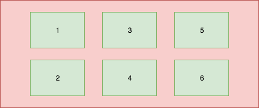
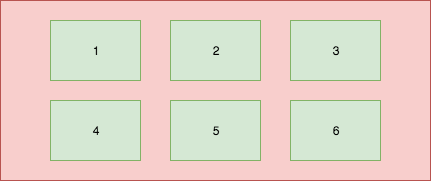

[  ](https://bintray.com/hanhailong/maven/gridpagersnaphelper/0.0.3)
[](https://travis-ci.org/hanhailong/GridPagerSnapHelper)

# GridPagerSnapHelper
A powerful tools to impl grid paging layout by RecyclerView

# 效果图


# Download

## JitPack

**Step 1. Add it in your root build.gradle at the end of repositories:**

```
allprojects {
    repositories {
	...
        maven { url 'https://jitpack.io' }
    }
}
```

**Step 2. Add the dependency**

```
dependencies {
    compile 'com.github.hanhailong:GridPagerSnapHelper:0.0.3'
}
```

## Jcenter(Recommend)

```
 compile 'com.hhl:gridpagersnaphelper:0.0.3'
```

## Maven

```
<dependency>
  <groupId>com.hhl</groupId>
  <artifactId>gridpagersnaphelper</artifactId>
  <version>0.0.3</version>
  <type>pom</type>
</dependency>
```


# Usage:

for example:

```
RecyclerView recyclerView = (RecyclerView) findViewById(R.id.recycler_view);
recyclerView.setHasFixedSize(true);

//setLayoutManager
GridLayoutManager gridLayoutManager = new GridLayoutManager(this, row, LinearLayoutManager.HORIZONTAL, false);
recyclerView.setLayoutManager(gridLayoutManager);

//attachToRecyclerView
GridPagerSnapHelper gridPagerSnapHelper = new GridPagerSnapHelper();
gridPagerSnapHelper.setRow(row).setColumn(column);
gridPagerSnapHelper.attachToRecyclerView(recyclerView);

int screenWidth = ScreenUtils.getScreenWidth(this);
int itemWidth = screenWidth / column;

//transform data list
List<DataSourceUtils.ItemData> dataList = DataSourceUtils.getDataSource();
dataList = GridPagerUtils.transformAndFillEmptyData(
        new OneRowDataTransform<DataSourceUtils.ItemData>(column), dataList);

//setAdapter
RecyclerViewAdapter adapter = new RecyclerViewAdapter(this, dataList, itemWidth);
recyclerView.setAdapter(adapter);
```

**Step 1. setLayoutManager:**

You'd better set a horizontal direction *GridLayoutManager*

**Step 2. RecyclerView attach to GridPagerSnaperHelper**

```
GridPagerSnapHelper gridPagerSnapHelper = new GridPagerSnapHelper();
gridPagerSnapHelper.setRow(row).setColumn(column);
gridPagerSnapHelper.attachToRecyclerView(recyclerView);
```
Here,you must set row and column

**Step 3. transform data list**

if your src data is *dataList*,you must transform it to dst data

```
GridPagerUtils.transformAndFillEmptyData(
        new OneRowDataTransform<DataSourceUtils.ItemData>(column), dataList);
```
Here,I have provided three transform order functions

1. OneRowDataTransform

    mapping one row,n column
2. TwoRowDataTransform

    mapping two row,n column 
3. ThreeRowDataTransform

    mapping three row,n column

You can impl your custom row funcitons by extends **AbsRowDataTransform**

# Why use AbsRowDataTransform?

In general，horizontal direction GridLayoutManager layout like this:



But,We want is the following case :



so,We need to make a transformation of the data.Here,**AbsRowDataTransform** can meet your needs.


# TODO

1. add indicator function

# Author

hanhailong worked in 58同城，A fantastic website

hanhailong.cool@163.com